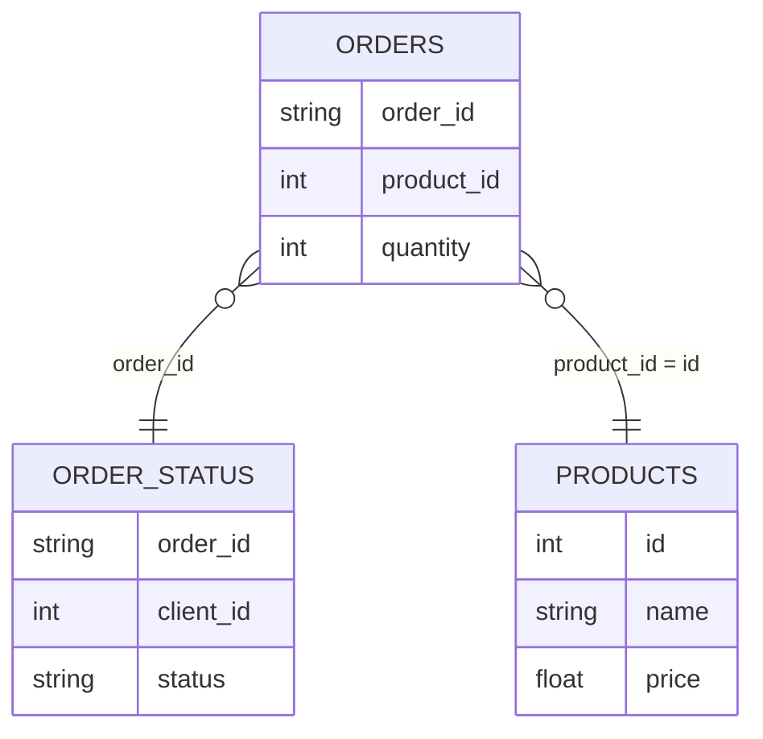
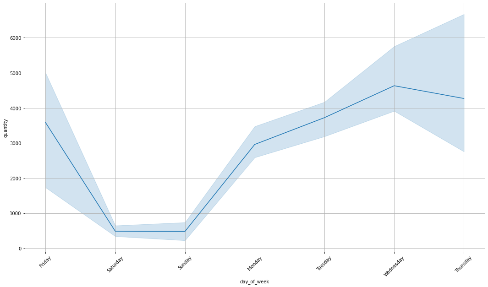
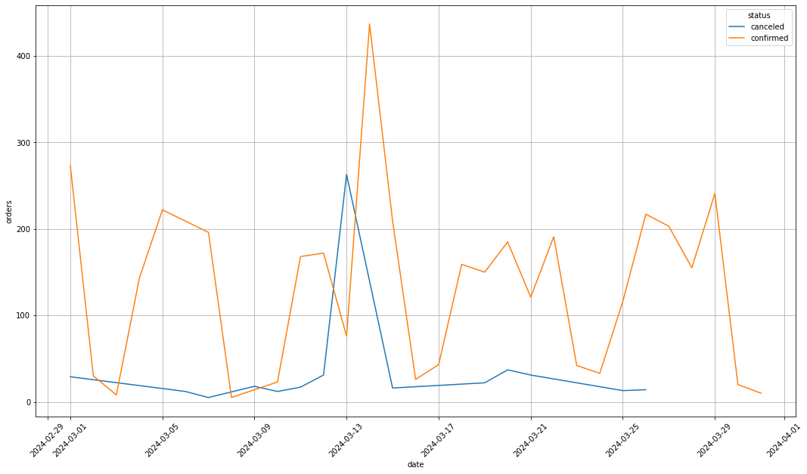
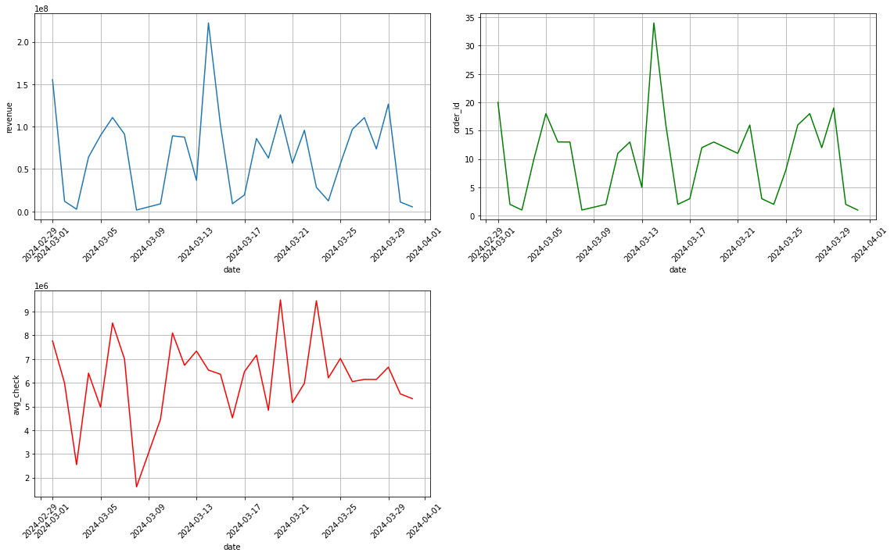
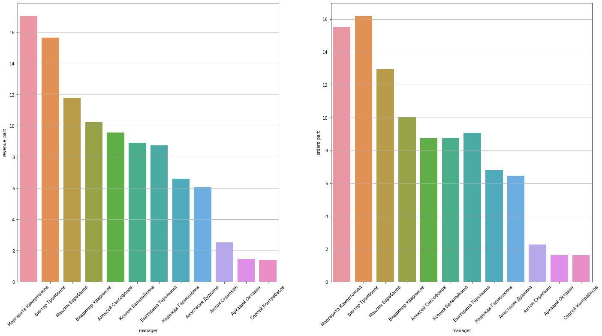

# Анализ оптовых продаж аудиотехники

Учебный проект по анализу данных на Python: сбор данных из разрозненной выгрузки, поиск аномалий
в динамике заказов, расчёт ключевых метрик и отчёты по брендам и менеджерам.

**Стек:** Python, pandas, NumPy, Matplotlib, Seaborn, Jupyter

## О проекте

Компания «Карпов Саунд» занимается оптовой продажей аудиотехники. Клиенты оставляют заявки в CRM,
менеджеры обрабатывают их, после чего заказ либо подтверждается, либо отменяется. Хранилище данных
временно недоступно, поэтому данные за март 2024 года доступны только в виде резервной выгрузки,
разложенной по папкам с датами, менеджерами и категориями товаров.

Задачи:

1. Собрать данные из разрозненных CSV-файлов в единые таблицы.
2. Изучить динамику заказов и найти дни, выбивающиеся из общей картины.
3. Посчитать выручку и средний чек в рублях с учётом ежедневного курса доллара.
4. Определить самые востребованные бренды и бренды, которые зря занимают место в ассортименте.
5. Подготовить отчёт по вкладу каждого менеджера.

## Данные



Дополнительно используется файл с курсом доллара на каждый день периода. Исходные данные в репозиторий
не входят, ожидаемая структура описана в [`data/README.md`](data/README.md).

## Основные результаты

**Недельная сезонность.** Основной поток заказов приходится на будни, по выходным заказов почти нет.
Отдельно выделяется 8 марта — праздничная пятница практически без заказов.



**Аномалия 13–14 марта.** 13 марта большая часть заказов была отменена, а 14 марта отмен не было,
но подтверждённых заказов оказалось рекордно много. Сопоставление заказов по клиенту, менеджеру и составу
показало, что значительная часть заказов 14 марта повторяет отменённые накануне. Всплеск вызван сбоем CRM,
а не ростом спроса.



**Ключевые метрики месяца.** Доля отменённых заказов — 11% (37 из 346), средний чек — около 6,6 млн ₽.
Выручка и число заказов колеблются в течение месяца, средний чек меняется независимо от них.



**Бренды.** Клиенты интересовались 121 брендом, лидер по выручке — JBL. Около 30% товаров (497 из 1677)
ни разу не заказывались; у Dali, KEF, Marantz и Pioneer не продаётся больше половины ассортимента.

**Менеджеры.** Лидеры — Маргарита Камертонова по доле выручки и Виктор Тромбонов по доле заказов.
Явного отрыва пятёрки лидеров нет, наименьший вклад — у Аркадия Октавина и Сергея Контрабасова.



**Рекомендации:** настроить мониторинг массовых отмен в CRM, пересмотреть ассортимент брендов
с большой долей непродаваемых товаров, разобрать результаты отстающих менеджеров.

## Структура репозитория

```
.
├── notebooks/
│   └── sales_analysis.ipynb   # основной ноутбук с анализом
├── data/
│   └── README.md              # описание ожидаемой структуры данных
├── images/                    # графики (ноутбук пересохраняет их при запуске)
├── requirements.txt
└── README.md
```

## Как запустить

```bash
git clone https://github.com/<username>/<repo-name>.git
cd <repo-name>
python -m venv venv
source venv/bin/activate        # Windows: venv\Scripts\activate
pip install -r requirements.txt
jupyter notebook notebooks/sales_analysis.ipynb
```

Перед запуском положите данные в папку `data/` согласно [`data/README.md`](data/README.md).
При запуске ноутбук сохраняет собранные таблицы в `data/processed/`, а графики — в `images/`.
